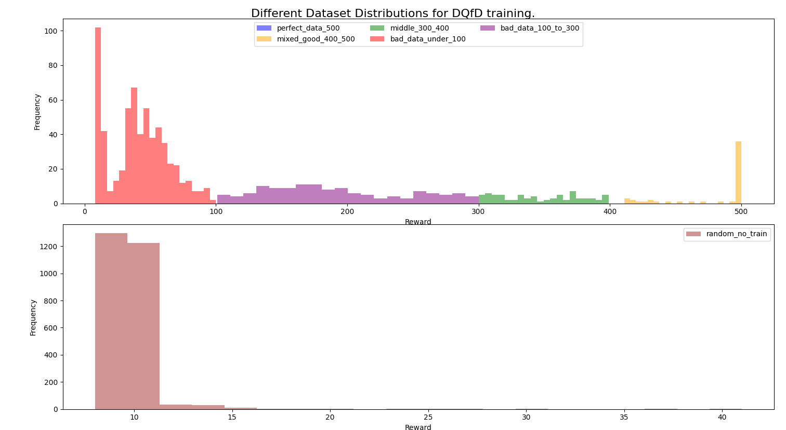
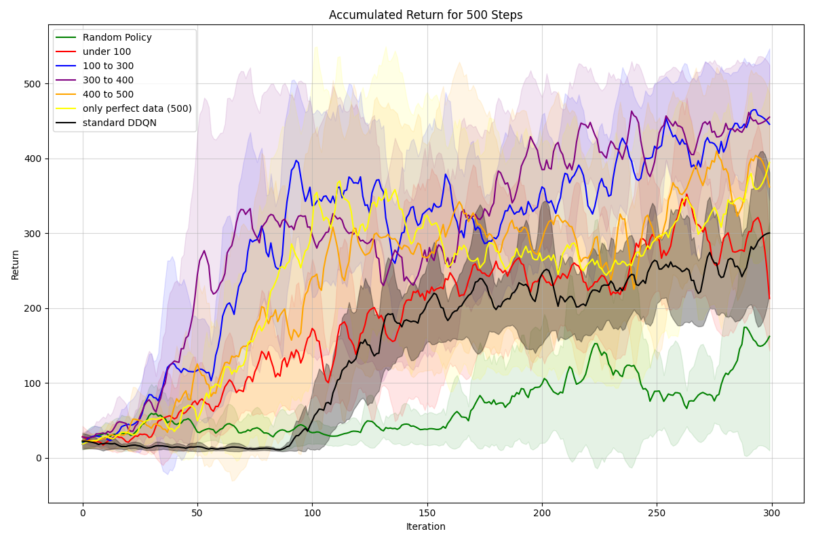
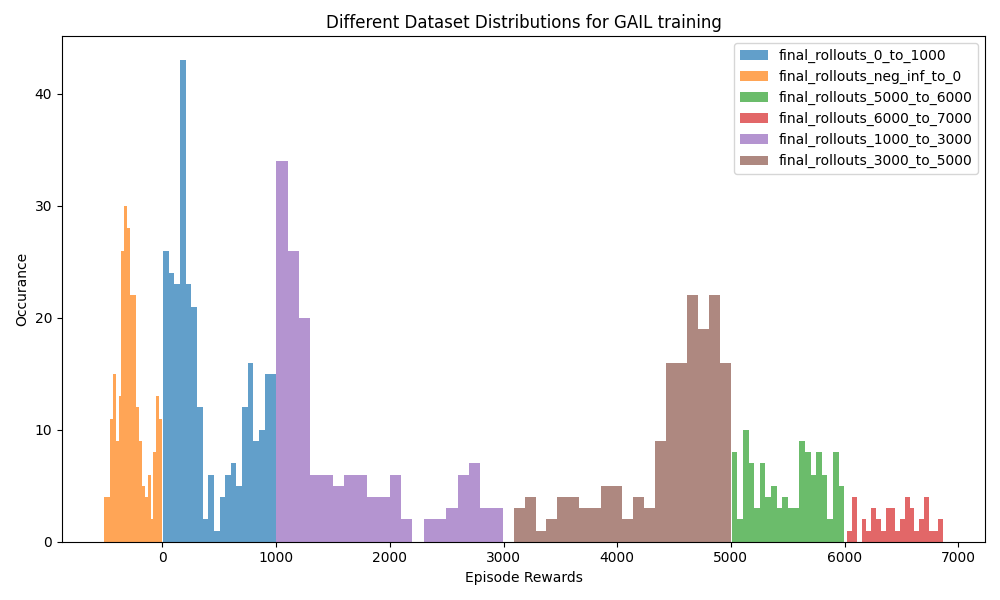
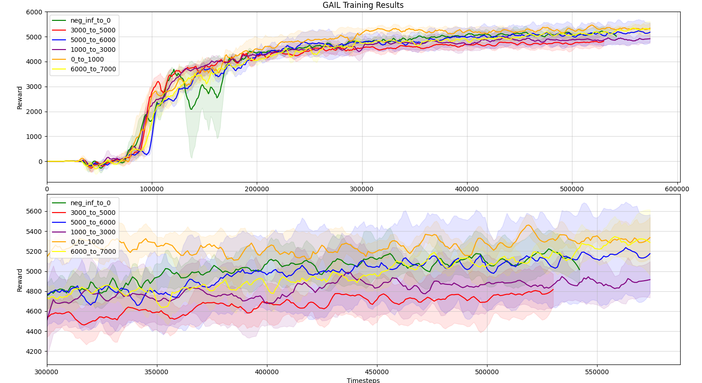

# influcence_of_expert_quality_on_DQfD_and_GAIL
This repository trains DQfD and GAIL with different qualities of expert data and analyzes their result.

# Structure
The repository contains two main folders. `DQfD` and `GAIL` contain all the code to run the respective algorithms. In `plots` the results are saved containing the result data downloaded from wandb and the plotted graphs.

# Execute DQfD
As a codebase [go2sea's implementation](https://github.com/go2sea/DQfD) of DQfD is used.

To generate demo data for training DQfD run `DQfD/get_demo_data.py` This runs DDQN while training the policy only partly and saving only episodes within a certain range.
Once the training data has been generated run `DQfD/DQfD_eval_diff_sets.py`. This script trains DQfD on a specific train set. To run DDQN for comparison run the script `DQfD/DQfD_CartPole.py`

To vizulise the dataset run `DQfD/analyze_dataset.py`. This will yield a distribution that looks the following:

The results when training DQfD on different qualities are the following:

# Execute GAIL
As a codebase, the [Imitation Library](https://imitation.readthedocs.io/en/latest/algorithms/gail.html) is used.

The first step here is to train a policy to generate training data. This can be done by executing the script `GAIL/create_demo_data.py`. To analyze the datasets created run the script `GAIL/create_hist.py`. The distribution used for this report is the following:

After having trained the policies `GAIL/process_data.py` generated the datasets and analysed them. Subsequently, `GAIL/split_dataset.py` can be used to split the resulting data sets into disjunct sets. `GAIL/eval_callback.py` contains the evaluation callback during training. Finally, to train GAIL run `GAIL/train_gail.py`

The results for GAIL with SAC as the generator are the following:
